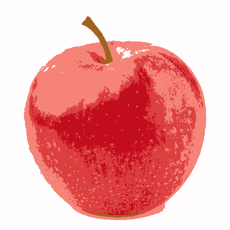
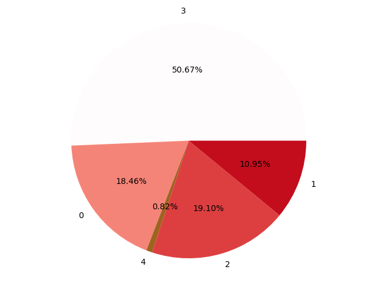
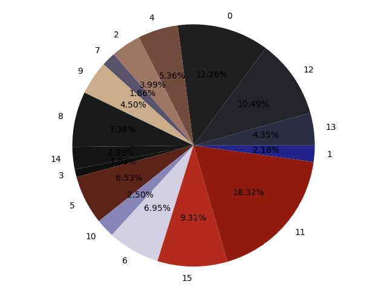
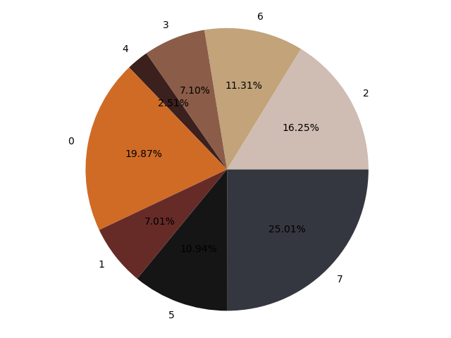

# About
  Utilizes k-means clustering algorithm to do image segmentation.
  K-means is an unsupervised learning technique where
  given data is sorted into *k* clusters.
  Compresses image and constructs a colour palette from
  the given image. Colour is stored as RGB values and pie 
  chart is constructed based on on the instances of the
  colour.
  
  I wrote the algorithm (with help from numpy) because I wanted to learn about the inner details and also because I find the
  subject particularly interesting. My implementation is specifically based on Andrew Ng's lecture notes on the subject 
  found [here](notes/notes.pdf).
  
# Examples
| Original Image        | Processed Image           | RGB Instances  |
| --------------------  | ------------------------- | ---------------|
| |  |  |
| |   |  |
|   |  |  |

# Credits:
Algorithm implemented according to [Andrew Ng](notes/notes.pdf)'s notes
  
